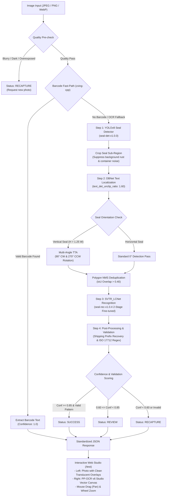

# Container Seal OCR

An application for recognizing **container seal numbers** from images. It automatically locates the seal, reads its barcode or printed characters, cleans the result, and evaluates its confidence.
[](https://postimg.cc/4mjqdk3c)
## Features

- Recognize a single image or process multiple images from the web interface.
- Automatically detect and crop the seal region.
- Read barcodes first and fall back to OCR when no valid barcode is found.
- Handle rotated seals and difficult character spacing.
- Detect images that are too small, dark, bright, or blurry and request a new photo.
- Return the seal number, confidence, processing time, and detected region.
- Provide an HTTP API for integration with other systems.

## Architecture & Workflow

The service employs a multi-stage pipeline combining Barcode decoding, Deep Learning Object Detection (YOLOv8), Differentiable Binarization Text Detection (DBNet), Fine-tuned Character Recognition (SVTR_LCNet), and Rule-based Post-processing.



### Pipeline Details

1. **Quality Pre-check & Barcode Fast-Path**:
   - Analyzes Laplacian variance and brightness to identify unusable images immediately.
   - Scans 1D and 2D barcodes (Code 128, DataMatrix, QR) via `zxing-cpp`. If a valid seal barcode is detected, the result is returned instantly at 100% confidence with zero OCR inference overhead.
2. **Step 1: YOLOv8 Seal Object Detection (`seal-det-v1.0.0`)**:
   - Pinpoints the seal lock bolt/capsule on container door locking rods, eliminating 90% of surrounding background interference (rust, hinges, door numbers, graffiti).
3. **Step 2: DBNet Text Localization & Multi-Angle TTA**:
   - Generates tight polygonal bounding boxes around text lines with `text_det_unclip_ratio = 1.60`, preventing adjacent vertical stamp lines (e.g., `SITC` and `SITR722371`) from merging.
   - For vertical seals (`height > 1.25 * width`), triggers 90° clockwise and 270° counter-clockwise Test-Time Augmentation (TTA).
   - Merges and deduplicates polygon candidates across angles using IoU-based Non-Maximum Suppression (> 0.40).
4. **Step 3: SVTR_LCNet Text Recognition (`seal-rec-v1.0.4`)**:
   - Utilizes a 2-stage fine-tuned recognition network specializing in container seal fonts and stamp variations, overcoming CTC blank collapse on repetitive digits (e.g. `000`, `111`).
5. **Step 4: Post-Processing, Validation & Scoring**:
   - Corrects optical confusions (`O`/`0`, `I`/`1`, `S`/`5`) using a dictionary of major shipping line prefixes (SITC, OOLK, MSC, MAERSK, ONE, etc.).
   - Validates length and format against ISO 17712 specifications.
   - Assigns a definitive status: `SUCCESS` ($\ge 0.85$), `REVIEW` ($0.60 - 0.85$), or `RECAPTURE` ($< 0.60$).
6. **Web Studio Interface (`/test`)**:
   - Clone of the PP-OCR v6 Studio side-by-side mode: the left canvas displays the original photo with translucent polygon fills (no opaque badges obstructing the letters), while the right canvas displays vector outlines with vertically stacked characters for vertical seals.
   - Interactive navigation: click and drag with the mouse to pan across zoomed images, with mouse wheel zoom support.

## Quick start with Docker

Make sure [Docker](https://www.docker.com/) and Git LFS are installed, then run these commands from the project directory:

```powershell
docker build -t container-seal-ocr .
docker run -d --rm --name container-seal-ocr -p 8000:7860 container-seal-ocr
```

After the service starts, open:

- Web interface: <http://localhost:8000/test>
- API documentation: <http://localhost:8000/docs>
- Service status: <http://localhost:8000/health/ready>

To stop the application:

```powershell
docker stop container-seal-ocr
```

## Use the web interface

1. Open <http://localhost:8000/test>.
2. Select or drag and drop a seal image into the upload area.
3. Click **Recognize**.
4. Review the seal number, confidence, and result status.

The interface also supports batch recognition, result filtering, and CSV export.

Supported image formats are JPEG, PNG, and WebP. The default maximum file size is 10 MB.

## Use the API

Recognition endpoint:

```text
POST /api/v1/ocr/seal
```

PowerShell example:

```powershell
curl.exe -X POST http://localhost:8000/api/v1/ocr/seal `
  -F "file=@C:\images\seal.jpg;type=image/jpeg"
```

Example response:

```json
{
  "status": "SUCCESS",
  "sealNumber": "SITR722371",
  "rawText": "SITC SITR722371",
  "confidence": 0.99,
  "source": "OCR",
  "processingTimeMs": 380,
  "modelVersion": "seal-det-v1.0.0-rec-v1.0.4",
  "reason": null,
  "imageWidth": 1280,
  "imageHeight": 720,
  "detections": [
    {
      "x": 450,
      "y": 120,
      "width": 320,
      "height": 480,
      "confidence": 0.96
    }
  ],
  "textLines": [
    {
      "polygon": [[520, 150], [560, 150], [560, 220], [520, 220]],
      "text": "SITC",
      "confidence": 0.98
    },
    {
      "polygon": [[525, 230], [565, 230], [565, 520], [525, 520]],
      "text": "SITR722371",
      "confidence": 0.99
    }
  ]
}
```

### Result statuses

| Status | Meaning |
|---|---|
| `SUCCESS` | The seal was recognized with high confidence. |
| `REVIEW` | A seal number was found, but it should be checked manually. |
| `RECAPTURE` | The image quality is insufficient or no valid seal was found. Take another photo. |
| `ERROR` | The upload or recognition request failed. |

`source` is `BARCODE` when the result comes from a barcode and `OCR` when it comes from printed characters.

## Run with Python

Python 3.11 or newer is required:

```powershell
python -m pip install -r requirements.txt
uvicorn app.main:app --host 127.0.0.1 --port 8000 --workers 1
```

Then open <http://localhost:8000/test>.

To change the model, image limits, or confidence thresholds, copy `.env.example` and set the required environment variables before starting the service.

## Run the tests

```powershell
python -m pip install -r requirements-test.txt
python -m pytest tests/ -q
```

## Prepare dataset for training

To prepare a training dataset in the simplest way possible:

### Option 1: Filename as label (Recommended)
Place seal photos in a folder and name each file with its seal number (e.g. `FX40295831.jpg`, `SITR722123.jpg`, `FX40295831_1.jpg`).

```powershell
python scripts/prepare_dataset.py --input path/to/images --output path/to/prepared_dataset
```

### Option 2: Folder of images + `labels.csv`
Place images in a folder and provide a 2-column CSV (`image,label`):

```powershell
python scripts/prepare_dataset.py --input path/to/images --output path/to/prepared_dataset
```

Add `--crop` to automatically crop seal regions using the YOLO detector. The script generates standard PaddleOCR `images/`, `train.txt`, `val.txt`, and `metadata.json`.

